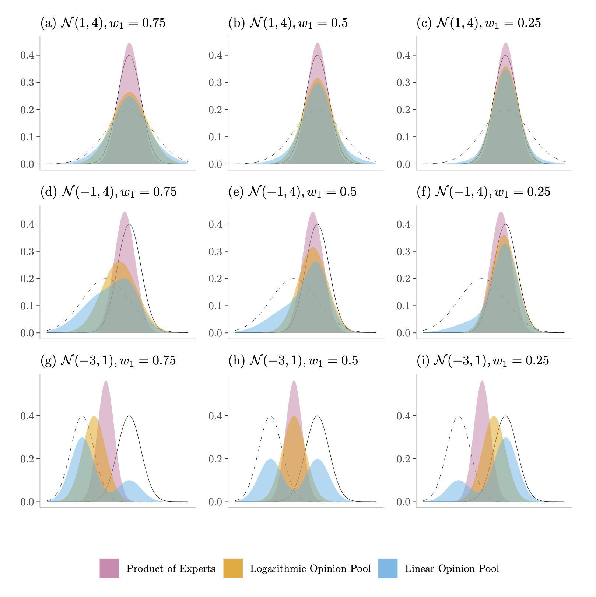

# Markov Melding
ST955: Dissertation, MSc Statistics, University of Warwick

Markov melding, proposed in the paper [Joining and splitting models with Markov melding](https://www.ncbi.nlm.nih.gov/pmc/articles/PMC6324725/) by Robert Goudie and colleagues, is a Bayesian computational method for evidence synthesis.
This masters dissertation is an outline of the method, together with an implementation of the algorithm in `R` applied to a simulated data example. 

* Code to reproduce all figures, tables etc. is contained within the R Markdown files for each chapter e.g. `meld/thesis/02-modelling.Rmd` for Chapter 2. The final thesis is uploaded [here](https://warwick.ac.uk/fac/sci/statistics/staff/academic-research/pollock/former/howes.pdf).
* For Example 3.2 the Bayesian random-effects meta-analysis is fit using `meld/code/smith_mwg.R`, Bayesian fixed-effects meta-analysis using `meld/code/fixed_mwg.R` and Markov melded model using `meld/code/meld_mwg.R`.
