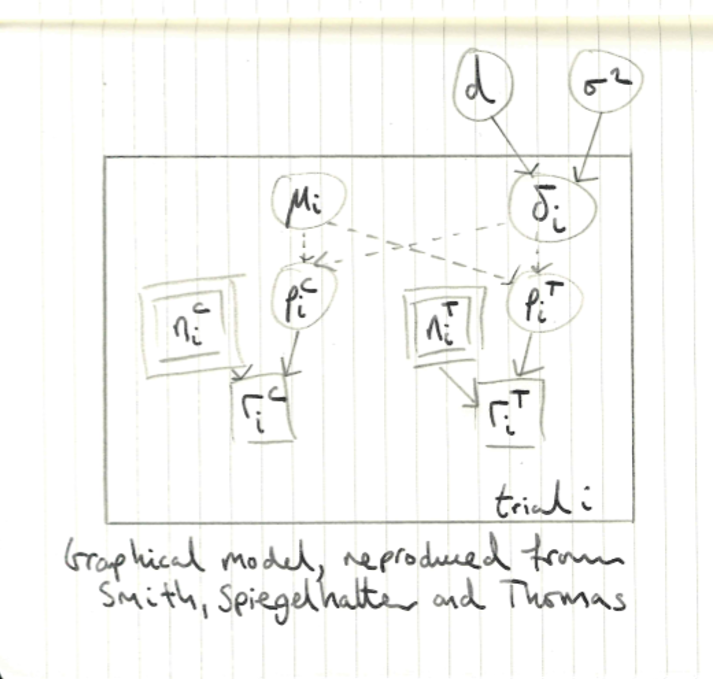

# Background

## Monte Carlo

Notes from Adam Johansen's Warwick course.

For the following samplers targeting density $f$ and starting with $x^{(0)} :=\left(x_{1}^{(0)}, \ldots, x_{p}^{(0)}\right)$, iterate for $t = 1, 2, \ldots$

### Metropolis-Hastings sampler

1. Draw $x \sim q\left(\cdot | x^{(t-1)}\right)$
2. With probability $\min \left\{1, \frac{f(x) \cdot q\left(x^{(t-1)} | x\right)}{f\left(x^{(t-1)}\right) \cdot q\left(x | x^{(t-1)}\right)}\right\}$ set $x^{(t)}=x$, else set $x^{(t)}=x^{(t-1)}$

Note that if the proposal $q$ is symmetric (as in random-walk metropolis-hastings) then the acceptance probability simplifies to $\min \left\{1, \frac{f(x)}{f\left(x^{(t-1)}\right)}\right\}$.

### (Random scan) Gibbs sampler

1. Draw $j \sim \text{Unif}\{1, \ldots, p\}$
2. Draw $x_{j}^{(t)} \sim f_{x_{j} | x_{-j}}\left(\cdot | x_{1}^{(t-1)}, \ldots, x_{j-1}^{(t-1)}, x_{j+1}^{(t-1)}, \ldots, x_{p}^{(t-1)}\right)$, and set $x_i^{(t)} :=x_i^{(t-1)}$ for all $i \neq j$

### (Random scan) Metropolis-within-Gibbs

1. Draw $j \sim \text{Unif}\{1, \ldots, p\}$
2. 
    a) Draw $x_{j} \sim q_j\left(\cdot | x^{(t-1)}\right)$ and set $x = \left(x_{1}^{(t-1)}, \ldots, x_j, \ldots,  x_{p}^{(t-1)}\right)$
    b) With probability $\min \left\{1, \frac{f(x) \cdot q\left(x^{(t-1)} | x\right)}{f\left(x^{(t-1)}\right) \cdot q\left(x | x^{(t-1)}\right)}\right\}$ set $x^{(t)}=x$, else set $x^{(t)}=x^{(t-1)}$

## Meta-analysis, evidence synthesis, combining expert opinion etc.

### Multiple Experts

Notes from Chapter 9 of [@o2006uncertain]

* Want to obtain a single distribution which encapsulates the beliefs of several experts
* Two approaches
    + Mathematical aggregation: elicit distribution from each expert individually and independently then mathematically combine
    + Behavioural aggregation: Create an interaction beween the group of experts through which a single distribution is elicited from the group as a whole
* In reference to Markov melding, it seems as though Behavioural approaches are not possible
* Each of a group of $n$ experts asked individually for her beliefs about some unknown quantity $\theta$, eliciting distributions $f_i(\theta)$ for $i = 1, \ldots, n$
* Formal Bayesian perspective (DM is a supra-Bayesian): DM begins with his own prior $f(\theta)$ for $\theta$ and has posterior $f(\theta | D)$ after incorporating the experts opinions $D = \{f_1(\theta), \ldots, f_n(\theta)\}$. This is difficult as DM must construct likelihood $f(D | \theta)$
* Simpler and widely used technique is opinion pooling where a consensus distribution $f(\theta)$ is obtained as some function of the individual distributions $\{f_1(\theta), \ldots, f_n(\theta)\}$
* Linear opinion pool $f(\theta) \propto \sum_{i=1}^{n} w_i f_i(\theta)$ where the weights $w_i$ sum to one
    + Could weight all experts equally $w_i = 1/n$ for all $i$
    + Alternatively, give more weight to some expert
    + Coherent marginalisation
    + This approach is not externally Bayesian: after recieving new information, updating the priors then pooling the result is not the same as updating the pooled prior
    + Not consistent with regard to judgements of independence
* Logarithmic opinion pool $f(\theta) \propto \prod_{i=1}^{n} f_i(\theta)^{w_i}$
    + Again can weight opinions as wishes
    + Externally Bayesian and consistent about independence
    + However, unlike linear, no coherent marginalisation (no pooling satisfies both externally Bayesian and coherent marginalisation)
* Product of Experts (special case of logarithmic pooling) $f(\theta) \propto \prod_{i=1}^{n} f_i(\theta)$ *To-do: look at Hinton 2002*
* Unlike supra-Bayesian approach, the result of opinion pooling does not represent the actual beliefs of any individual as so may not behave as one would expect a probability distribution to
* "In general, while the linear opinion pool has been quite widely used in practice, the logarithmic opinion pool has been largely ignored, perhaps because it is perceived to lead to unrealistically strong aggregated beliefs"
* Dictatorial pooling $f(\theta) = f_i(\theta)$ for some $i = 1, \ldots, n$ (not mentioned in book)
* Cooke's method
* *To-do: for more about opinion pooling, look at Clemen*

## Graphical models

### Bayesian networks

Notes from Chapter 7 of [@smith2010bayesian].

#### Relevance, informativeness and independence

* Client believes that measurement $X$ is irrelevant for predicting $Y$ given the measurement $Z$, written $Y \perp X | Z$ if she believes now that once she learns the value of $Z$ then then measurement of $X$ will provide her with no extra useful information with which to predict the value of $Y$. 
* In this case, if she is a Bayesian, then she could write her conditional density $p(y | x, z) = p(y | z)$ so that it did not depend on the value of $x$ for all possible values of $(x, y, z)$. Equivalently the joint mass function can be factorised as $p(x, y, z) = p(y | z)p(x | z)p(z)$
* Two most important and universally applicable rules:
    + Symmetry $Y \perp X | Z \iff X \perp Y | Z$
    + Perfect composition $X \perp (Y, Z) | W \iff X \perp Y | (W, Z) \iff X \perp Z | W$
* *To-do: look at some work of Pearl*

#### Bayesian networks and DAGs

* Bayesian network is a simple and convenient way of representing a factorisation of a joint pdf of a vector of random variables $\mathbf{X} = (X_1, X_2, \ldots, X_n)$.
* Always the case that $p(\mathbf{x}) = p(x_1)p(x_2 | x_1)p(x_3 | x_2, x_1) \times \cdots \times p(x_n | x_1, x_2, \ldots, x_{n-1})$ 
* Often many of the functions $p(x_i | x_1, x_2, \ldots, x_{i-1})$ are explicit functions of components of $X$ whose indices lie in a proper subset $Q_i \subset \{1, 2, \ldots, i - 1\}$ so that $p(x_i | x_1, x_2, \ldots, x_{i-1}) = p(x_i | \mathbf{x}_{Q_i})$
* Now $p(\mathbf{x}) = p(x_1)\prod_{i=2}^n p(x_i | \mathbf{x}_{Q_i})$
* Let the remainder set $R_i = \{1, 2, \ldots, i - 1\} \ Q_i$ then the above bullet point is equivalent to the set of $n-1$ irrelevance statements $X_i \perp \mathbf{X}_{R_i} | \mathbf{X}_{Q_i}, \, 2 \leq i \leq n$
* Definition: A directed acyclic graph (DAG) $\mathcal{G} = (\mathcal{V}, \mathcal{E})$ with set of vertices $\mathcal{V}$ and set of directed edges $\mathcal{E}$ is a directed graph having no directed cycles
* Definition: A Bayesian network (BN) on the set of measurements $\{X_1, X_2, \ldots, X_n\}$ is a set of the $n-1$ conditional irrelevance statements together with a DAG $\mathcal{G}$. The set of vertices $\mathcal{G} = \{X_1, X_2, \ldots, X_n\}$ and a directed edge from $X_i$ to $X_j$ is in $\mathcal{E}$ if and only if $i \in Q_j$

### Factor graphs

Notes from [@bishop2006pattern].

* Factor graphs: ``Factor graphs make this decomposition explicit by introducing additional nodes for the factors themselves in addition to the nodes representing the variables.''
* $p(\mathbf{x}) = \prod_s f_s(\mathbf{x}_s)$ where each factor $f_s$ is a function of the corresponding set of variables $x_s$ 

## Miscellaneous reading

### Bayesian approaches to random-effects meta-analysis

Notes from [@smith1995bayesian]

* Meta analysis, also known as systematic overview, is a statistical procedure in which the results of several independent studies are integrated. Aim is to resolve issues that cannot be concluded from a single study alone
* *Note: [Gelman blog post about why fixed and random effects terminology is confusing]( https://statmodeling.stat.columbia.edu/2005/01/25/why_i_dont_use/)*
* Fixed-effect analysis: a common effect across studies is estimated
* Random-effects model: a probability model for individual study effects is assumed
* "In contrast to the pooled estimate arising from a fixed-effect model, a random-effects meta-analysis assumes that the true effects in each trial are not necessarily equal, but are random observations drawn from some common population distribution"

Let $r^C_i$ denote the number of infections in the control group in trial $i$, arising from $n^C_i$ cases each assumed to have probability $p^C_i$ of developing an infection. Adopt equivalent notation for the treatment group and assume that $\delta_i$ is the true treatment effect on a log-odds scale such that

$$
\delta_i = \mathrm{logit}(p^T_i) - \mathrm{logit}(p^C_i).
$$
The "average" infection rate in the $i$th trial is

$$
\mu_i = \frac{1}{2} (\mathrm{logit}(p^T_i) + \mathrm{logit}(p^C_i)).
$$
Individual trial effects are drawn from some Gaussian population with mean $d$ and variance $\sigma^2$, giving the full model as

\begin{align*}
r^C_i &\sim \text{Binomial}\left(p^C_i, n^C_i\right) \\
r^T_i &\sim \text{Binomial}\left(p^T_i, n^T_i\right) \\
\text{logit}(p^C_i) &= \mu_i - \delta_i/2 \\
\text{logit}(p^T_i) &= \mu_i + \delta_i/2 \\
\delta_i &\sim \text{Normal}(d, \sigma^2)
\end{align*}

* Empirical Bayes' methods estimate $d$ and $\sigma^2$ from the data by moment-matching, then make inferences conditional on these estimates $\hat d$, $\hat \sigma^2$ but this does not propigate uncertainty about the estimates. Instead full Bayes puts priors on the unknown parameters
* Based on suitable DAG, see Figure 1., the joint distribution is $p(V) = \prod_{v \in V} p(v | \text{pa}(v))$
* Used Gibbs sampling (BUGS) to perform inference

### The statistical basis of meta-analysis

[@fleiss1993review]

* $C$ denote the total number of studies to be analyzed, $c = 1, \ldots, C$
    + First approach: take these $C$ studies as the only ones of interest
    + Second approach: take the $C$ studies as a sample from a larger population of studies (fixed vs random set of studies)

### Bayesian calibration of computer models

[@kennedy2001bayesian]

* Calibration: the activity of adjusting the unknown rate parameters until the outputs of the model fit the observed data
* Bayesian approach with unknown inputs as parameter vector $\theta$
* Uncertainties in computer models
    + Parameter uncertainty: uncertainty about the values of some of the computer code inputs
    + Model inadequacy: no model is perfect. Can't predict the true value of the process (Note that this is not about stochasticity of the process, define model inadequacy to be difference between true mean value of the real world process and the code output at the true values of inputs)
    + Residual variability: the real process may not always take the same value for the same repeated inputs. This incompases potential inherent unpredictability, but it may also be that this variation would be eliminated or reduced if only more input conditions were recognised and specified within the model.
    + Parametric variability: prediction with random parametric inputs (my interpretation)
    + Observation error: uncertainty about the observations used for calibration
    + Code uncertainty
* Objective of uncertainty analysis is to study the distribution of the code output that is induced by probability distributions on inputs. Simple Monte Carlo approach: draw configurations of inputs at random from their distribution and run code for each sample input. LHS is better than random sample
* Sensitivity analysis aims to characterize how the code output responds to changes in the inputs
* Generalised likelihood uncertainty estimation: MC sample from prior on unknown inputs, predictions made using this sample weighted by likelihood
* Craig et al. (1992) calibration adopting Bayes linear philosophy (Goldstein)
* Raftery et al. (1995) an attempt to combine prior expert opinion on both the calibration parameters and the model output: Bayesian synthesis. Critizised by Wolpert (1995) and Schweder and Hjort (1996), and in a follow-up paper Poole and Raftery (1998) propose Bayesian melding. Neither method explicitly recognises model inadequacy (!!) - related to link parameter discussions?
* You can use $f(\cdot) \sim \mathcal{GP}(m(\cdot), k(\cdot, \cdot))$ to model unknown functions as random 

### Inference for deterministic simulation models: the Bayesian melding approach

[@poole2000inference]

* Deterministic simulation model: inputs $\to$ outputs
* Easier to build and interpret than a stochastic model
* May be very complicated: large number of inputs and outputs, often non-invertible

### Combining Models

Chapter 14 of [@bishop2006pattern]

This chapter is mainly in reference to combining models for prediction (classification and regression) e.g. Bayesian model averaging, committees, boosting. Perhaps there are some connections here which can be made?
