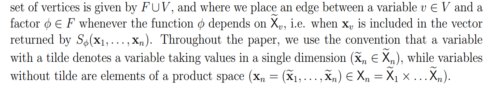
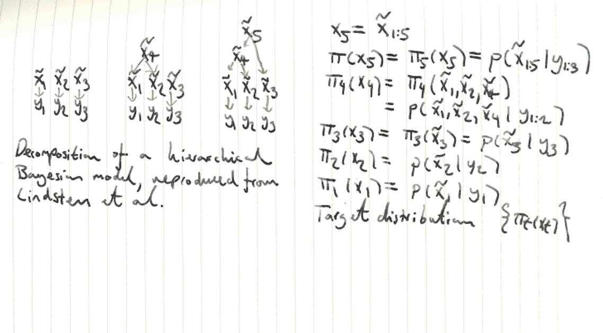

# Sequential Monte Carlo

In the end want to understand @lindsten2017divide

## Tutorial on Particle Filtering and Smoothing

Notes from @doucet2009tutorial

* HMM with hidden states $\{X_n\}_{n\geq1}$ and observations $\{Y_n\}_{n\geq1}$ defined by
    + $X_1 \sim \mu\left(x_1\right), \; X_n | \left(X_{n-1}=x_{n-1}\right) \sim f\left(x_n | x_{n-1}\right)$
    + $Y_n | \left(X_n = x_n\right) \sim g\left(y_n | x_n\right)$
* Could see this from a Bayesian perspective as a prior $p(x_{1:n})$ and a likelihood function $p(y_{1:n} | x_{1:n})$ with posterior $p(x_{1:n} | y_{1:n}) = \frac{p(x_{1:n}, y_{1:n})}{p(y_{1:n})}$
* Tractable in the discrete setting or for the linear Gaussian model, more generally use particle methods (a subset of Sequential Monte Carlo methods)
* More generally, SMC methods sample sequentially from a sequence of target probability densities $\{\pi_n(x_{1:n})\}$ of increasing dimension where each distribution $\pi_n(x_{1:n})$ is defined on the product space $\mathcal{X}^n$
* Writing $\pi_n\left(x_{1:n}\right) = \frac{\gamma_n\left(x_{1:n}\right)}{Z_n}$ it is only required that $\gamma_n:\mathcal{X}^n \to \mathbb{R}^+$ is known pointwise - the normalising constant $Z_n$ might be unknown
* SMC provides an approximation of $pi_n(x_{1:n})$ and an estimate of $Z_n$ at time $n$
* Monte Carlo basics: approximate by the empircal measure $\widehat{\pi}_n \left(x_{1:n}\right) = \frac{1}{N} \sum_{i=1}^{N} \delta_{X_{1:n}^i}\left(x_{1:n}\right)$
    + Problem 1: can't sample from $\pi_n(x_{1:n})$
    + Problem 2: even if we could sample exactly from $\pi_n(x_{1:n})$ it's probably at least $O(n)$
* Importance Sampling: use an importance densisty $q_n(x_{1:n})$ and reweight samples by $w_n(x_{1:n}) = \frac{\gamma_n\left(x_{1:n}\right)}{q_n\left(x_{1:n}\right)}$

### Sequential Importance Sampling

Select an importance distribution with the structure 
$$q_n\left(x_{1:n}\right)=q_{n-1}\left(x_{1:n-1}\right) q_n\left(x_n | x_{1:n-1}\right) = q_1(x_1) \prod_{k=2}^n q_k(x_k | x_{1:k-1})$$

In practice, this means sampling each $X_k$ from a distribution given $X_{1:k-1}$. The unnormalised weights are then
\begin{align*}
w_n\left(x_{1:n}\right) 
&= \frac{\gamma_n\left(x_{1:n}\right)}{q_n\left(x_{1:n}\right)} \\ 
&=\frac{\gamma_{n-1}\left(x_{1:n-1}\right)}{q_{n-1}\left(x_{1:n-1}\right)} \frac{\gamma_n\left(x_{1:n}\right)}{\gamma_{n-1}\left(x_{1:n-1}\right) q_n\left(x_n | x_{1:n-1}\right)} \\
&= w_{n-1}\left(x_{1:n-1}\right) \alpha_n(x_{1:n}) \\
&= \cdots = w_1(x_1) \prod_{k=2}^n \alpha_k(x_{1:k})
\end{align*}

where the incremental importance weight function $\alpha_n(x_{1:n})$ is given by
$$
\alpha_n(x_{1:n}) = \frac{\gamma_n\left(x_{1:n}\right)}{\gamma_{n-1}\left(x_{1:n-1}\right) q_n\left(x_n | x_{1:n-1}\right)}
$$

SIS algorithm, with each step carried out for $i = 1, \ldots, N$:
>
* At time $n = 1$
    1. Sample $X_1^i \sim q_1\left(x_1\right)$
    2. Compute the weights $w_1(X_1^i)$ and $W_1^i \propto w_1(X_1^i)$ (normalised weights)
* At time $n \geq 2$
    1. Sample $X_n^i \sim q_n\left(x_n | X_{1:n-1}^i\right)$
    2. Compute the weights $w_n(X_{1:n}^i) = w_{n-1}\left(X_{1:n-1}^i\right) \alpha_n\left(X_{1:n}^{i}\right)$ and $W_n^i \propto w_n(X_{1:n}^i)$

How to choose $q_n(x_n | x_{1:n-1})$? To minimise variance of $w_n(x_{1:n})$ choose $q_n^{\mathrm{opt}}\left(x_n | x_{1:n-1}\right)=\pi_n\left(x_n | x_{1 : n-1}\right)$. One problem is that the variance of resulting estimates increases exponentially with $n$.

### Resampling

* Resampling partially solves problem of increasing variance in some cases
* Resample $N$ times from $\widehat{\pi}_n \left(x_{1:n}\right)$ 
    + Either by selecting $X_{1:n}^i$ with probability $W_n^i$
    + Or by associating a number of offspring $N_n^i$ with each particle $X_{1:n}^i$ in such a way that $N_n^{1:N}=\left(N_n^1, \ldots, N_n^N\right) \sim \mathrm{Multinomial}(\cdot | N, W_n^{1:N})$ and giving a weight of $1/N$ to each offspring
* Approximate $\widehat{\pi}_n \left(x_{1:n}\right) \approx \overline{\pi}_n\left(x_{1:n}\right)=\sum_{i=1}^{N} \frac{N_n^i}{N} \delta_{X_{1:n}^i}\left(x_{1:n}\right)$ where $\mathbb{E}[N_n^i | W_n^{1:N}] = NW_n^i$ so that the resampled empirical measure is an unbiased approximation
* Other (unbiased) resampling schemes have been proposed in the literature which have smaller variance in the number of offspring of each particle than by multinomial resampling, in descending order of popularity/efficiency
    + Systematic resampling: Sample $U_1 \sim \mathcal{U}[0, \frac{1}{N}]$ and define $U_i = U_1 + \frac{i-1}{N}$ for $i = 2, \ldots, N$, then set $N_n^i = \left|\left\{U_{j} : \sum_{k=1}^{i-1} W_{n}^{k} \leq U_{j} \leq \sum_{k=1}^{i} W_{n}^{k}\right\}\right|$ with the convention that $\sum_{k=1}^0 := 0$
    + Residual resampling: (might look at later)
    + Multinomial resampling: (already mentioned)
* "Intuitively, resampling can be seen to provide stability in the future at the cost of an increase in the immediate Monte Carlo variance"

### Sequential Monte Carlo

* SMC methods are a combination of SIS and resampling

SIR algorithm, with each step carried out for $i = 1, \ldots, N$:
>
* At time $n = 1$
    1. Sample $X_1^i \sim q_1\left(x_1\right)$
    2. Compute the weights $w_1(X_1^i)$ and $W_1^i \propto w_1(X_1^i)$ (normalised weights)
    3. Resample $\{W_1^i, X_1^i\} to obtain $N$ equally-weighted particles $\{\frac{1}{N}, \overline{X}_1^i\}$
* At time $n \geq 2$
    1. Sample $X_n^i \sim q_n\left(x_n | X_{1:n-1}^i\right)$
    2. Compute the weights $w_n(X_{1:n}^i) = w_{n-1}\left(X_{1:n-1}^i\right) \alpha_n\left(X_{1:n}^{i}\right)$ and $W_n^i \propto w_n(X_{1:n}^i)$
    3. Resample $\{W_1^i, X_{1:n}^i\} to obtain $N$ equally-weighted particles $\left\{\frac{1}{N}, \overline{X}_{1:n}^i\right\}$
    
* In practise it is sensible to only resample when the variance of the unnormalised weights is above some threshold
* Often the Effective Sample Size (ESS) is used which is given at time $n$ by $\left(\sum_{i=1}^N (W_n^i)^2\right)^{-1}$ and can be interpreted as the number of unweighted samples the $N$ weighted samples are roughly equivalent to (in terms of estimator variance)

SIR algorithm with adaptive resampling, with each step carried out for $i = 1, \ldots, N$:

>
* At time $n = 1$
    1. Sample $X_1^i \sim q_1\left(x_1\right)$
    2. Compute the weights $w_1(X_1^i)$ and $W_1^i \propto w_1(X_1^i)$ (normalised weights)
    3. If resampling criterion met then resample $\{W_1^i, X_1^i\} to obtain $N$ equally-weighted particles $\{\frac{1}{N}, \overline{X}_1^i\}$ and set $\{\overline{W}_1^i, \overline{X}_1^i\} \leftarrow \{\frac{1}{N}, \overline{X}_1^i\}$, else set $\{\overline{W}_1^i, \overline{X}_1^i\} \leftarrow \{W_1^i, X_1^i\}$
* At time $n \geq 2$
    1. Sample $X_n^i \sim q_n\left(x_n | X_{1:n-1}^i\right)$
    2. Compute the weights $w_n(X_{1:n}^i) = w_{n-1}\left(X_{1:n-1}^i\right) \alpha_n\left(X_{1:n}^{i}\right)$ and $W_n^i \propto w_n(X_{1:n}^i)$
    3. If resampling criterion met then resample $\{W_n^i, X_{1:n}^i\} to obtain $N$ equally-weighted particles $\{\frac{1}{N}, \overline{X}_{1:n}^i\}$ and set $\{\overline{W}_n^i, \overline{X}_n^i\} \leftarrow \{\frac{1}{N}, \overline{X}_n^i\}$, else set $\{\overline{W}_n^i, \overline{X}_n^i\} \leftarrow \{W_n^i, X_n^i\}$

## Seqential Monte Carlo Sampling Methods for Bayesian Filtering

Notes from @doucet2000sequential

## Divide and Conquer with SMC

Notes from @lindsten2017divide

* Recent interest in using SMC to sample from probability distributions which do not arise from chain-shaped PGM
* SMC to target a sequence of auxiliary distributions which are constructed to admit the original distbution as an appropriate marginal [@del2006sequential] such as
    + Likelihood tempering [@del2006sequential]
    + Data tempering
    + Sequential model decompositions
* But sequential decomposition might not be the most natural, nor computational efficient way of approaching the problem
* Idea: approximation can be made to any multivariate distribution by splitting the collection of model variables into disjoint sets and defining, for each of these sets, a suitable auxiliary target distribution

### Background and Problem Formulation

* Target $\pi(x) = \gamma(x)/Z$ and want to
    1. Approximate $Z$ (Bayes: approximate the marginal likelihood)
    2. Compute integrals under $\pi$ of some test function $f: \mathcal{X} \to \mathbb{R}$ (Bayes: compute the posterior expectation of some function)
* Assumptions required to write a model as a factor graph:
    1. State space $\mathcal{X}$ takes the form of a product space $\mathcal{X} = \mathcal{X}_n = \widetilde{\mathcal{X}}_1 \times \widetilde{\mathcal{X}}_2 \times \cdots \times \widetilde{\mathcal{X}}_n$. Define the set of variables, $V$ corresponding to the elements of this factorisation $1, 2, \ldots, n$
    2. The unnormalised density $\gamma$ can be decomposed as $\gamma(x_n) = \gamma(\widetilde{x_1}, \ldots, \widetilde{x_n}) = \prod_{\phi \in F} \phi(S_\phi(\widetilde{x_1}, \ldots, \widetilde{x_n}))$, where $F$ is a set of factors and the function $S_\phi$ returns a sub-vector of $(\widetilde{x_1}, \ldots, \widetilde{x_n})$ containing those elements upon which factor $\phi$ depends.
* Define a factor graph as a bipartite graph, where the set of vertices is given by $F \cup V$, and where we place an edge between a variable $v \in V$ and a factor $\phi \in F$ whenever the function $\phi$ depends on $\widetilde{x_v}$, i.e. when $\widetilde{x_v}$ is included in the vector returned by $S_\phi(\widetilde{x_1}, \ldots, \widetilde{x_n})$

### SMC

* SMC can be used to simulate from a sequence of probability distributions defined on a sequence of spaces of increasing dimension
* $\pi_t(x_t)$ with $x_t := (\widetilde{x_1}, \cdots, \widetilde{x_t})$ be a pdf defined on the product space $\mathcal{X_t} = \widetilde{\mathcal{X}}_1 \times \widetilde{\mathcal{X}}_2 \times \cdots \times \widetilde{\mathcal{X}}_t$
* Assume $\pi_t(x_t) = \gamma_t(x_t)/Z_t$ where $\gamma_t$ can be evaluated point-wise but the normalising constant $Z_t$ is computationally intractable
* SMC provides a way to sequentially approximate $\pi_1, \pi_2, \cdots, \pi_n$ and also provides unbiased estimates of $Z_1, Z_2, \cdots, Z_n$
* SMC approximation of $\pi_t$ at iteration $t$ takes the form of a particle population $\{x_t^i, w_t^i\}_{i=1}^N$ where $x_t^i \in \mathcal{X}_t$ and $w_t^i \geq 0$
* The discrete probability distribution obtained after normalising the weights is

$$
\widehat{\pi}_t^N(\cdot) := \frac{1}{\sum_{j=1}^N w_t^j} \sum_{i=1}^{N} w_t^j\delta_{x_t^i}(\cdot)
$$

which can be used to approximate a test function $\varphi$ under $\pi_t$
$$
\int \pi_t(x_t)\varphi(x_t)dx_t \approx \frac{1}{\sum_{j=1}^N w_t^j} \sum_{i=1}^{N} w_t^j\varphi(x_t^i)
$$

Simplest type of SMC algorithm, $\texttt{sir}(t)$ (slightly different presentation to @doucet2009tutorial)

>
1. If $t = 0$, return $(\{\emptyset, 1\}_{i=1}^N, 1)$
2. $(\{x_{t-1}^i, w_{t-1}^i\}_{i=1}^N, \hat{Z}_{t-1}^N) \leftarrow \texttt{sir}(t-1)$
3. Resample $(\{x_{t-1}^i, w_{t-1}^i\}_{i=1}^N, \hat{Z}_{t-1}^N)$ to obtain the unweighted particle population $\left\{\check{x}_{t-1}^i, 1\right\}_{i=1}^{N}$
4. For particle $i = 1, \ldots, N$:
    (a) Simulate $\widetilde{x}_t^i \sim q_t\left(\cdot | \check{x}_{t-1}^i\right)$
    (b) Set $x_t^i = (\check{x}_{t-1}^i, \widetilde{x}_t^i)$
    (c) Compute $\frac{\gamma_{t}\left(x_t^i\right)}{\gamma_{t-1}\left(\check{x}_{t-1}^i\right)} \frac{1}{q_t\left(\widetilde{x}_t^i | \check{x}_{t-1}^i\right)}$
5. Compute $\hat{Z}_t^N = \{\frac{1}{N} \sum_{i=1}^N w_t^i\} \hat{Z}_{t-1}^N$
6. Return $(\{x_t^i, w_t^i\}_{i=1}^N, \hat{Z}_t^N)$

* Improvement (as mentioned @doucet2009tutorial) is to only resample when particle degeneracy is severe
* Classical application of SMC: chain-structured factor graphs such as state-sapce models or hidden Markov models. For a chain-graph, the joint pdf can be factorised as $\pi(x)=\frac{1}{Z} \prod_{t=1}^{n} \phi_t\left(\widetilde{x}_{t-1}, \widetilde{x}_t\right)$. To simulate from the target distribution SIR employs a sequence of intermediate distributions $\pi_t(x_t) \propto \prod_{s=1}^{t} \phi_s\left(\widetilde{x}_{s-1}, \widetilde{x}_s\right)$
* In fact, it is possible to make use of similar sequential decompositions even when the original graph is not a chain [@naesseth2014sequential]

#### Interlude: @naesseth2014sequential

* Via a sequential decomposition of the PGM we find a sequence of auxiliary distributions defined on a monotonically increasing sequence of probability spaces
* *To-do*

### SMC samplers and tempering

*To-do*

### Methodology

* D&C-SMC methodology generalises the classical SMC framework from sequences (or chains) to trees
* Collection of auxiliary distributions $\{\pi_t: t \in T\}$ where instead of $T = \{1, 2, \cdots, n\}$ we generalise $T$ to be nodes in a tree
* $\mathcal{C}(t) \subset T$ denote the children of node $t$, with $\mathcal{C}(t) = \emptyset$ if $t$ is a leaf and let $t \in T$ denote the root of the tree. $\pi_t$ has a density also denoted $\pi_t$ on the set $\mathcal{X}_t$
* Tree decomposition if
    + Root distribution coincides with the target distribution, $\pi_r = \pi$
    + The spaces on which the node distributions are defined are constructed recursively as $\mathcal{X}_t = (\otimes_{c\in\mathcal{C}(t)} \mathcal{X}_c) \times \widetilde{\mathcal{X}}_t$
    

* D&C-SMC approximates $\pi = \pi_r$ based on the auxiliary distributions $\{\pi_t: t \in T\}$
* Similar to $\texttt{sir}$ but maintains multiple independent populations of weighted particles $\left(\left\{x_t^i, w_t^i\right\}_{i=1}^{N} : t \in T_k\right)$ which are propagated and merged as the algorithm progresses (here $T_k$ is the set of indicies of "active" target distributions at iteration $k$, $1 \leq k \leq \text{depth}(T)$)
* Bottom-up approach to simulate from auxiliary target distributions by repeated resampling, proposal and weighting steps

