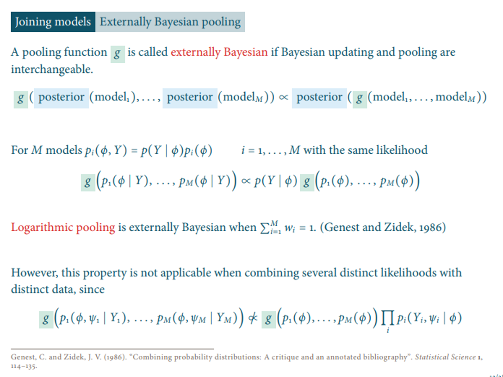

# Toy Examples

## Ex 1

```{r echo=FALSE}
pacman::p_load(tidyverse, RColorBrewer, bayesplot)
#brewer.pal(10, "Paired")
```

Submodel 1, $\mathcal{M}_1$:
\begin{align*}
\theta &\sim \text{Beta}(a, b) \\
Y_1 &\sim \text{Bin}(m, \theta)
\end{align*}

Submodel 2, $\mathcal{M}_2$:
\begin{align*}
\theta &\sim \text{Beta}(c, d) \\
Y_2 &\sim \text{Geo}(\theta)
\end{align*}

* The true value of $\theta = 0.4$
* Say that $m = 10$ is known to begin with
* Observe data $\mathcal{D}_1 = \{y_1^i\}_{i = 1, \ldots, n_1}$ and $\mathcal{D}_2 = \{y_2^i\}_{i = 1, \ldots, n_2}$

```{r}
set.seed(3)

theta <- 0.4

n1 <- 5
n2 <- 5

m <- 10

a <- 2
b <- 2

c <- 4
d <- 7

y1 <- rbinom(n1, m, theta)
tau1 <- sum(y1)
y1

y2 <- rgeom(n2, theta)
tau2 <- sum(y2)
y2
```

Inference for $\mathcal{M}_1$ can be done exactly (conjuate prior):

\begin{align*}
p_1(\theta | \mathcal{D}_1) &\propto p_1(\mathcal{D}_1 | \theta) p_1(\theta) \\
&= \prod_{i=1}^{n_1} {m\choose y_1^i} \theta^{y_1^i}  (1- \theta)^{m-{y_1^i}} \cdot 
   \frac{\Gamma(a)\Gamma(b)}{\Gamma(a+b)} \theta^{a-1} (1- \theta)^{b-1} \\
&\propto \theta^{\tau_1 + a - 1}  (1- \theta)^{n_1m-\tau_1 + b - 1} \\
&\propto \text{Beta}(\tau_1 + a, n_1m-\tau_1 + b)
\end{align*}

where $\sum_{i=1}^{n_1} y_1^i = \tau_1$

Inference for $\mathcal{M}_2$ can also be done exactly (conjuate prior):

\begin{align*}
p_2(\theta | \mathcal{D}_2) &\propto p_2(\mathcal{D}_2 | \theta) p_2(\theta) \\
&= \prod_{i=1}^{n_2} (1-\theta)^{y_2^i} \theta \cdot 
   \frac{\Gamma(c)\Gamma(d)}{\Gamma(c+d)} \theta^{c-1} (1- \theta)^{d-1} \\
&\propto \theta^{n_2 + c - 1}  (1- \theta)^{\tau_2 + d - 1} \\
&\propto \text{Beta}(n_2 + c, \tau_2 + d)
\end{align*}

where $\sum_{i=1}^{n_2} y_2^i = \tau_2$

```{r echo=FALSE}
plot1 <- ggplot(data = data.frame(x = c(0, 1)), aes(x)) +
  stat_function(fun = dbeta, n = 100, 
                args = list(shape1 = a, shape2 = b),
                geom = "area", fill = "#A6CEE3", alpha = 0.6) +
  stat_function(fun = dbeta, n = 100, 
                args = list(shape1 = a + tau1, shape2 = b + n1*m - tau1),
                geom = "area", fill = "#1F78B4", alpha = 0.6) +
  geom_vline(xintercept = theta, colour="grey30", linetype = "longdash") +
  ylim(c(0, 6.5)) +
  labs(title = "Prior and Posterior for Submodel 1")


plot2 <- ggplot(data = data.frame(x = c(0, 1)), aes(x)) +
  stat_function(fun = dbeta, n = 100, 
                args = list(shape1 = c, shape2 = d),
                geom = "area", fill = "#B2DF8A", alpha = 0.6) +
  stat_function(fun = dbeta, n = 100, 
                args = list(shape1 = n2 + c, shape2 = tau2 + d),
                geom = "area", fill = "#33A02C", alpha = 0.6) +
  geom_vline(xintercept = theta, colour="grey30", linetype = "longdash") +
  ylim(c(0, 6.5)) +
  labs(title = "Prior and Posterior for Submodel 2")


cowplot::plot_grid(plot1, plot2)

# geom_vline(xintercept = theta, colour="grey30", linetype = "longdash") +
```

* Use Markov melding with Product of Experts pooling $p_\text{pool}(\theta) = \text{Beta}(a + b, c + d)$

\begin{align*}
p_{\text{meld}}(\theta | \mathcal{D}_1, \mathcal{D}_2) 
&\propto p_{\text{pool}}(\theta) \prod_{m=1}^{2} \frac{p_m\left(\theta | \mathcal{D}_m\right)}{p_{m}(\theta)} \\
&\propto p_1(\theta)p_2(\theta) \prod_{m=1}^{2} \frac{p_m\left(\theta | \mathcal{D}_m\right)}{p_{m}(\theta)} \\
&\propto p_1(\theta | \mathcal{D}_1)p_2(\theta | \mathcal{D}_2) \\
&\propto \text{Beta}(\tau_1 + a + n_2 + c, n_1m-\tau_1 + b + \tau_2 + d)
\end{align*}

```{r echo=FALSE}
ggplot(data = data.frame(x = c(0, 1)), aes(x)) +
  stat_function(fun = dbeta, n = 100, 
                args = list(shape1 = a + c, shape2 = b + d),
                geom = "area", fill = "#FDBF6F", alpha = 0.6) +
  stat_function(fun = dbeta, n = 100, 
                args = list(shape1 = tau1 + a + n2 + c, shape2 = n1*m - tau1 + b + tau2 + d),
                geom = "area", fill = "#FF7F00", alpha = 0.6) +
    geom_vline(xintercept = theta, colour="grey30", linetype = "longdash") +
    labs(title = "Pooled Prior and Posterior for PoE Melded Model")
```

* In general, under PoE pooling, the melded posterior is proportional to the product of the submodel posteriors

\begin{align*}
p_{\text{meld}}(\phi, \psi_1, \ldots, \psi_M | y_1, \cdots, y_M) 
&\propto p_{\text{pool}}(\phi) \prod_{m=1}^{M} \frac{p_m\left(\phi, \psi_m, y_m\right)}{p_{m}(\phi)} \\
&\propto \prod_{m=1}^{M} p_m\left(\phi, \psi_m, y_m\right) \\
&\propto \prod_{m=1}^{M} p_m\left(\phi, \psi_m | y_m\right)
\end{align*}



* Markov melding with linear opinion pooling $w_1 = w_2 = 0.5$ does not appear to have a closed form density (mixture model)

\begin{align*}
p_{\text{meld}}(\theta | \mathcal{D}_1, \mathcal{D}_2) 
&\propto p_{\text{pool}}(\theta) \prod_{m=1}^{2} \frac{p_m\left(\theta | \mathcal{D}_m\right)}{p_{m}(\theta)} \\
&\propto p_1(\theta | \mathcal{D}_1)p_2(\theta | \mathcal{D}_2)\left(\frac{p_1(\theta) + p_2(\theta)}{p_1(\theta)p_2(\theta)} \right)
\end{align*}

* Try Random walk Metropolis algorithm to target this density

\begin{align*}
\log p_{\text{meld}}(\theta | \mathcal{D}_1, \mathcal{D}_2) 
&\propto \log p_1(\theta | \mathcal{D}_1) + \log p_2(\theta | \mathcal{D}_2) + \log (p_1(\theta) + p_2(\theta)) - \log p_1(\theta) - \log p_2(\theta)
\end{align*}

```{r}
dlinbeta <- function(x, a, b, c, d) { # This is mainly for plotting ease
  0.5* dbeta(x, a, b) + dbeta(x, c, d)
}
```

```{r}
logtarget <- function(x) {
  if(0 < x & x < 1) {
    return(log(dbeta(x, shape1 = tau1 + a + n2 + c, 
                        shape2 = n1*m - tau1 + b + tau2 + d)) + 
           log(dbeta(x, a, b) + dbeta(x, c, d)) - 
           log(dbeta(x, a, b)) - log(dbeta(x, c, d))
    )
  }
    else return(-Inf)
}

rwm <- function(scale, nsim = 10000, x0 = 0.5) {
  X <- c(x0, rep(0, (nsim - 1)))
  U <- runif(nsim)
  E <- rnorm(nsim, mean = 0, sd = scale)
  count <- 0
  for(i in 2:nsim) {
    Y <- X[i-1] + E[i]
    a <- exp(logtarget(Y) - logtarget(X[i-1]))
    if(a > U[i]) {
      X[i] <- Y
      count <- count + 1
    } 
    else {
      X[i] <- X[i-1]
    }
  }
  return(list("chain" = X, 
              "accept" = count/(nsim - 1),
              "corr" = as.numeric(acf(X, plot = FALSE)[1][[1]])
              )
         )
}

run <- rwm(scale = 0.15)
mcmc_trace(as.data.frame(run$chain)) # Traceplot
run$accept # Close to optimal for one-dimension (0.44)
```

```{r echo=FALSE, warning=FALSE}
plot3 <- ggplot(data = data.frame(x = c(0, 1)), aes(x)) +
  stat_function(fun = dlinbeta, n = 100, 
                args = list(a, b, c, d),
                geom = "area", fill = "#FDBF6F", alpha = 0.6) +
  geom_vline(xintercept = theta, colour="grey30", linetype = "longdash") +
  labs(title = "Linear Opinion Pool Prior")

plot4 <- ggplot() + 
  geom_histogram(aes(x = run$chain), bins = 30, fill = "#FF7F00", alpha = 0.6) +
  geom_vline(xintercept = theta, colour="grey30", linetype = "longdash") +
  xlim(c(0,1)) +
  labs(title = "Linear Opinion Pool Posterior")

cowplot::plot_grid(plot3, plot4)
```

```{r include=FALSE}
points <- seq(0.01, 0.99, by = 0.01) # Code to check that the MCMC is right
plot(exp(apply(as.data.frame(points), MARGIN = 1, FUN = logtarget))) 
```

* *To-do: put both these plots on the same axis, compare PoE with linear pooling*

## Ex 2

Keep $\mathcal{M}_2$ the same but change $\mathcal{M}_1$ such that $m$ is no longer given. Place a Poisson prior on $m$

\begin{align*}
\theta &\sim \text{Beta}(a, b) \\
m &\sim \text{Pois}(\lambda) \\
Y_1 &\sim \text{Bin}(m, \theta)
\end{align*}

* No longer conjugate (as far as I know)

\begin{align*}
p(\theta, m | \mathcal{D}_1) &\propto p_1(\mathcal{D}_1 | \theta, m) p_1(\theta) p_1(m) \\
&\propto \prod_{i=1}^{n_1} {m\choose y_1^i} \theta^{y_1^i}  (1- \theta)^{m-{y_1^i}} \cdot 
   \theta^{a-1} (1- \theta)^{b-1} \cdot
   \frac{\lambda^m}{m!}
\end{align*}

\begin{align*}
\log p(\theta, m | \mathcal{D}_1) \propto &\sum_{i=1}^{n_1} \left( \log {m\choose y_1^i} + y_1^i\log\theta + (m-{y_1^i}) \log (1- \theta) \right) + \\
&(a-1) \log \theta + (b-1) \log (1- \theta) + m \log \lambda - \log m!
\end{align*}
